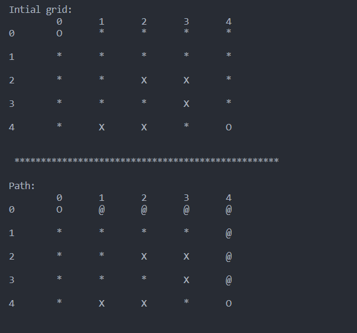

# A* Path finding algorithm

To run, type `python main.py` in the terminal. 
You can change the default values like the x/y of the grid or amount of obstacle nodes by updating the constants at the top of `main.py`.

### File breakdown:
* `main.py` - main method and A* algorithm.
* `node.py` - Node class representing a node on the board.
* `board.py` - contains functionality with creating and printing the board.

### Example output:
